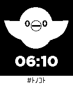
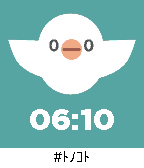
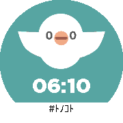

## Pebble watchface "esa"

"esa" means "Expertise Sharing Archives for motivated teams".

This is very useful web service that is provided at https://esa.io/ .
I like this service and love the cute character.

Wear this cute "esa" watchface on your wrist.
Enjoy !

## Screenshot

### Pebble / Pebble Steel

### Pebble Time

### Pebble Time Round

## Notice

This watchface app is unofficial, but it use official logo data provided by esa LLC.

## License

This watchface app is under MIT License.
"esa" logo and 自家製 Rounded M+ are under different license. see below:

### "esa" logo

* https://docs.esa.io/posts/125
    * [CC BY-NC-ND 4.0](http://creativecommons.org/licenses/by-nc-nd/4.0/deed.en)

### 自家製 Rounded M+ font

* http://jikasei.me/font/rounded-mplus/
    * [M+ FONT LICENSE](http://mplus-fonts.osdn.jp/mplus-outline-fonts/index.html#license)

This watchface used `rounded-mplus-1c-regular.ttf`.
